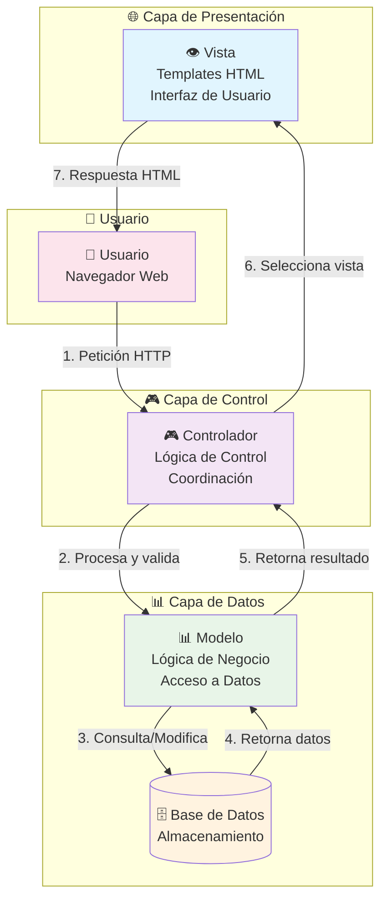
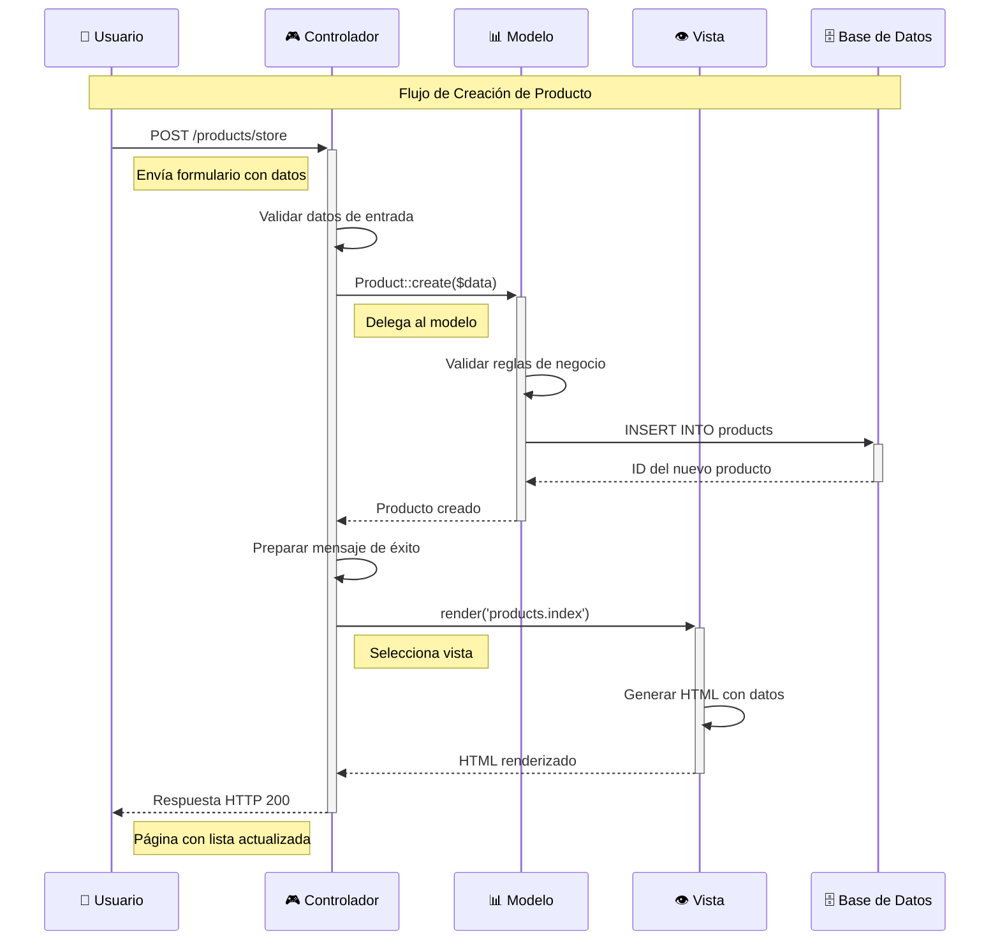
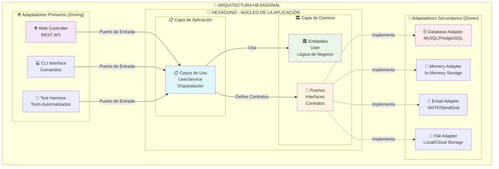
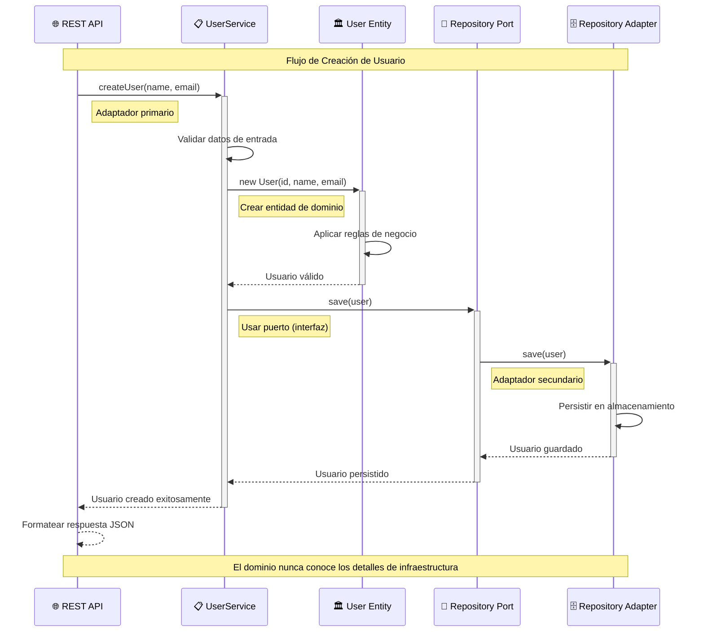
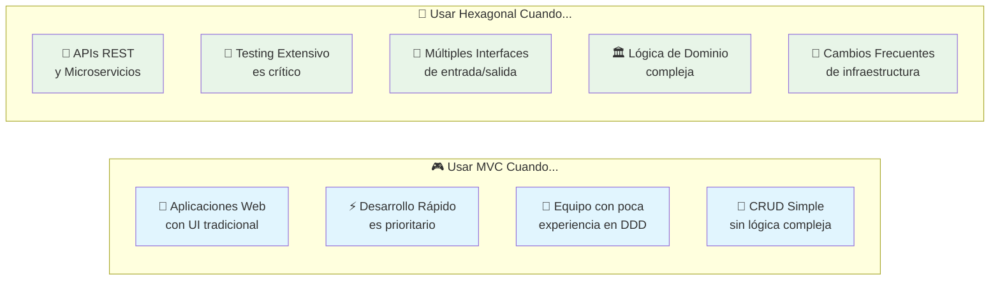
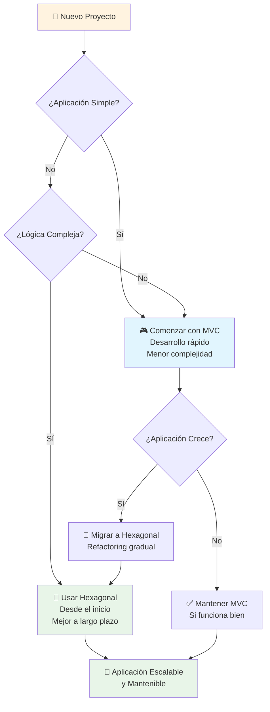

# 🏗️ Patrones de Arquitectura de Software en PHP

Este repositorio contiene implementaciones prácticas de dos importantes patrones arquitectónicos en PHP: **MVC (Modelo-Vista-Controlador)** y **Arquitectura Hexagonal (Ports and Adapters)**. Cada implementación incluye ejemplos funcionales, documentación detallada y diagramas explicativos.

## 📋 Tabla de Contenidos

- [🎯 Objetivo del Proyecto](#-objetivo-del-proyecto)
- [📁 Estructura del Repositorio](#-estructura-del-repositorio)
- [🎮 Patrón MVC](#-patrón-mvc)
  - [Concepto y Filosofía](#concepto-y-filosofía-mvc)
  - [Diagrama de Arquitectura](#diagrama-de-arquitectura-mvc)
  - [Flujo de Datos](#flujo-de-datos-mvc)
  - [Implementación](#implementación-mvc)
- [🔷 Arquitectura Hexagonal](#-arquitectura-hexagonal)
  - [Concepto y Filosofía](#concepto-y-filosofía-hexagonal)
  - [Diagrama de Arquitectura](#diagrama-de-arquitectura-hexagonal)
  - [Flujo de Datos](#flujo-de-datos-hexagonal)
  - [Implementación](#implementación-hexagonal)
- [⚖️ Comparación de Patrones](#️-comparación-de-patrones)
- [🚀 Cómo Ejecutar los Proyectos](#-cómo-ejecutar-los-proyectos)
- [📚 Recursos y Referencias](#-recursos-y-referencias)

## 🎯 Objetivo del Proyecto

Este proyecto educativo tiene como objetivo demostrar de manera práctica y visual las diferencias, ventajas y casos de uso de dos patrones arquitectónicos fundamentales en el desarrollo de software:

- **MVC**: Ideal para aplicaciones web tradicionales con interfaz de usuario
- **Arquitectura Hexagonal**: Perfecta para APIs, microservicios y aplicaciones con alta testabilidad

## 📁 Estructura del Repositorio

```
PATRONES/
├── 📂 mvc/                    # Implementación del patrón MVC
│   ├── 📂 app/               # Lógica de la aplicación
│   │   ├── 📂 controllers/   # Controladores MVC
│   │   ├── 📂 models/        # Modelos de datos
│   │   └── 📂 views/         # Vistas/Templates
│   ├── 📂 config/            # Configuración y enrutamiento
│   ├── 📂 public/            # Punto de entrada web
│   └── 📄 README.md          # Documentación específica MVC
├── 📂 hexagonal/             # Implementación Arquitectura Hexagonal
│   ├── 📂 src/              # Código fuente
│   │   ├── 📂 Domain/       # Capa de dominio
│   │   ├── 📂 Application/  # Capa de aplicación
│   │   └── 📂 Infrastructure/ # Capa de infraestructura
│   ├── 📂 public/           # API REST
│   └── 📄 README.md         # Documentación específica Hexagonal
└── 📄 README.md             # Este archivo (documentación general)
```

---

## 🎮 Patrón MVC

### Concepto y Filosofía MVC

El patrón **Modelo-Vista-Controlador (MVC)** es un patrón arquitectónico que separa una aplicación en tres componentes interconectados. Esta separación permite una mejor organización del código, facilita el mantenimiento y promueve la reutilización.

#### 🎯 Principios Fundamentales:
- **Separación de Responsabilidades**: Cada componente tiene una función específica
- **Bajo Acoplamiento**: Los componentes son independientes entre sí
- **Alta Cohesión**: Cada componente agrupa funcionalidades relacionadas
- **Reutilización**: Los componentes pueden ser reutilizados en diferentes contextos

### Diagrama de Arquitectura MVC



### Flujo de Datos MVC



### Implementación MVC

#### 📊 **Modelo (Model)**
```php
// app/models/Product.php
class Product extends Model
{
    protected $table = 'products';
    protected $fillable = ['name', 'description', 'price', 'category', 'stock'];
    
    public function validate($data) {
        // Lógica de validación de negocio
        // Reglas específicas del dominio
    }
    
    public function calculateDiscount($percentage) {
        // Lógica de negocio específica
    }
}
```

#### 🎮 **Controlador (Controller)**
```php
// app/controllers/ProductController.php
class ProductController extends Controller
{
    public function store() {
        // 1. Validar entrada
        $data = $this->validateInput($_POST);
        
        // 2. Interactuar con modelo
        $product = (new Product())->create($data);
        
        // 3. Preparar respuesta
        $this->setFlashMessage('Producto creado exitosamente');
        
        // 4. Seleccionar vista
        $this->redirect('/products');
    }
}
```

#### 👁️ **Vista (View)**
```php
<!-- app/views/products/index.php -->
<div class="container">
    <h1>📦 Gestión de Productos</h1>
    
    <?php foreach ($products as $product): ?>
        <div class="product-card">
            <h3><?= htmlspecialchars($product['name']) ?></h3>
            <p><?= htmlspecialchars($product['description']) ?></p>
            <span class="price">$<?= number_format($product['price'], 2) ?></span>
        </div>
    <?php endforeach; ?>
</div>
```

---

## 🔷 Arquitectura Hexagonal

### Concepto y Filosofía Hexagonal

La **Arquitectura Hexagonal**, también conocida como **Ports and Adapters**, fue propuesta por Alistair Cockburn. Su objetivo principal es crear aplicaciones que puedan ser igualmente ejecutadas por usuarios, programas, tests automatizados o scripts batch, y que puedan ser desarrolladas y testeadas de forma aislada de sus dispositivos y bases de datos.

#### 🎯 Principios Fundamentales:
- **Inversión de Dependencias**: El dominio no depende de la infraestructura
- **Separación de Capas**: Dominio, Aplicación e Infraestructura claramente separadas
- **Puertos y Adaptadores**: Interfaces que permiten intercambiar implementaciones
- **Testabilidad**: Fácil testing mediante mocks y stubs

### Diagrama de Arquitectura Hexagonal



### Flujo de Datos Hexagonal



### Implementación Hexagonal

#### 🏛️ **Dominio (Domain)**
```php
// src/Domain/Entity/User.php
class User
{
    private int $id;
    private string $name;
    private string $email;
    
    public function __construct(int $id, string $name, string $email) {
        $this->validateEmail($email);
        $this->id = $id;
        $this->name = $name;
        $this->email = $email;
    }
    
    private function validateEmail(string $email): void {
        if (!filter_var($email, FILTER_VALIDATE_EMAIL)) {
            throw new InvalidArgumentException("Email inválido");
        }
    }
}

// src/Domain/Port/UserRepositoryInterface.php
interface UserRepositoryInterface
{
    public function save(User $user): User;
    public function findById(int $id): ?User;
    public function findAll(): array;
}
```

#### 📋 **Aplicación (Application)**
```php
// src/Application/UseCase/UserService.php
class UserService implements UserServiceInterface
{
    private UserRepositoryInterface $userRepository;
    
    public function __construct(UserRepositoryInterface $userRepository) {
        $this->userRepository = $userRepository;
    }
    
    public function createUser(string $name, string $email): User {
        // Validaciones de aplicación
        $existingUser = $this->userRepository->findByEmail($email);
        if ($existingUser) {
            throw new InvalidArgumentException("Email ya existe");
        }
        
        // Crear entidad de dominio
        $user = new User($this->generateId(), $name, $email);
        
        // Persistir usando puerto
        return $this->userRepository->save($user);
    }
}
```

#### 🔧 **Infraestructura (Infrastructure)**
```php
// src/Infrastructure/Adapter/Repository/InMemoryUserRepository.php
class InMemoryUserRepository implements UserRepositoryInterface
{
    private array $users = [];
    
    public function save(User $user): User {
        $this->users[$user->getId()] = $user;
        return $user;
    }
    
    public function findById(int $id): ?User {
        return $this->users[$id] ?? null;
    }
}

// src/Infrastructure/Adapter/Web/UserController.php
class UserController
{
    private UserServiceInterface $userService;
    
    public function createUser(): void {
        $data = json_decode(file_get_contents('php://input'), true);
        
        try {
            $user = $this->userService->createUser(
                $data['name'], 
                $data['email']
            );
            
            $this->jsonResponse($user->toArray(), 201);
        } catch (Exception $e) {
            $this->jsonResponse(['error' => $e->getMessage()], 400);
        }
    }
}
```

---

## ⚖️ Comparación de Patrones

### 📊 Tabla Comparativa

| Aspecto | 🎮 MVC | 🔷 Hexagonal |
|---------|--------|--------------|
| **Propósito Principal** | Separar presentación de lógica | Aislar dominio de infraestructura |
| **Complejidad** | ⭐⭐ Baja-Media | ⭐⭐⭐⭐ Media-Alta |
| **Curva de Aprendizaje** | ⭐⭐ Fácil | ⭐⭐⭐⭐ Moderada |
| **Testabilidad** | ⭐⭐⭐ Buena | ⭐⭐⭐⭐⭐ Excelente |
| **Flexibilidad** | ⭐⭐⭐ Buena | ⭐⭐⭐⭐⭐ Excelente |
| **Casos de Uso Ideales** | Aplicaciones web tradicionales | APIs, microservicios, sistemas complejos |
| **Dependencias** | Vista depende del Modelo | Infraestructura depende del Dominio |
| **Inversión de Control** | ⭐⭐ Parcial | ⭐⭐⭐⭐⭐ Completa |

### 🎯 Cuándo Usar Cada Patrón



### 🔄 Evolución Arquitectónica



---

## 🚀 Cómo Ejecutar los Proyectos

### 📋 Requisitos Previos

- **PHP 7.4+** instalado
- **Servidor web** (Apache/Nginx) con mod_rewrite habilitado
- **MAMP/XAMPP** o servidor local configurado

### 🎮 Ejecutar Aplicación MVC

```bash
# 1. Navegar al directorio MVC
cd /Applications/MAMP/htdocs/LEARN/PATRONES/mvc

# 2. Acceder desde el navegador
http://localhost/LEARN/PATRONES/mvc/public/

# 3. Funcionalidades disponibles:
# - Gestión completa de productos (CRUD)
# - Interfaz web responsive
# - Validaciones en tiempo real
```

#### 🌟 Características de la App MVC:
- ✅ **Crear productos** con validación completa
- ✅ **Listar productos** con paginación
- ✅ **Editar productos** existentes
- ✅ **Eliminar productos** con confirmación
- ✅ **Interfaz responsive** con Bootstrap 5
- ✅ **Notificaciones** de éxito/error

### 🔷 Ejecutar API Hexagonal

```bash
# 1. Navegar al directorio Hexagonal
cd /Applications/MAMP/htdocs/LEARN/PATRONES/hexagonal

# 2. Acceder a la API
http://localhost/LEARN/PATRONES/hexagonal/public/

# 3. Endpoints disponibles:
# GET    /users          - Listar usuarios
# POST   /users          - Crear usuario
# GET    /users/{id}     - Obtener usuario
# PUT    /users/{id}     - Actualizar usuario
# DELETE /users/{id}     - Eliminar usuario
```

#### 🧪 Probar la API con cURL:

```bash
# Crear usuario
curl -X POST http://localhost/LEARN/PATRONES/hexagonal/public/users \
  -H "Content-Type: application/json" \
  -d '{"name":"Ana García","email":"ana@example.com"}'

# Obtener todos los usuarios
curl http://localhost/LEARN/PATRONES/hexagonal/public/users

# Obtener usuario específico
curl http://localhost/LEARN/PATRONES/hexagonal/public/users/1

# Actualizar usuario
curl -X PUT http://localhost/LEARN/PATRONES/hexagonal/public/users/1 \
  -H "Content-Type: application/json" \
  -d '{"name":"Ana María García","email":"anamaria@example.com"}'

# Eliminar usuario
curl -X DELETE http://localhost/LEARN/PATRONES/hexagonal/public/users/1
```

### 🔧 Configuración del Servidor

#### Apache (.htaccess)
```apache
RewriteEngine On
RewriteCond %{REQUEST_FILENAME} !-f
RewriteCond %{REQUEST_FILENAME} !-d
RewriteRule ^(.*)$ index.php [QSA,L]
```

#### Nginx
```nginx
location / {
    try_files $uri $uri/ /index.php?$query_string;
}
```

---

## 📚 Recursos y Referencias

### 📖 Documentación Oficial
- [Patrón MVC - Wikipedia](https://es.wikipedia.org/wiki/Modelo%E2%80%93vista%E2%80%93controlador)
- [Hexagonal Architecture - Alistair Cockburn](https://alistair.cockburn.us/hexagonal-architecture/)
- [Clean Architecture - Robert C. Martin](https://blog.cleancoder.com/uncle-bob/2012/08/13/the-clean-architecture.html)

### 🎓 Conceptos Relacionados
- **SOLID Principles**: Principios de diseño orientado a objetos
- **Domain-Driven Design (DDD)**: Diseño dirigido por el dominio
- **Dependency Injection**: Inyección de dependencias
- **Test-Driven Development (TDD)**: Desarrollo dirigido por pruebas

### 🛠️ Herramientas Recomendadas
- **PHPUnit**: Framework de testing para PHP
- **Composer**: Gestor de dependencias de PHP
- **Docker**: Containerización para desarrollo
- **Postman**: Testing de APIs REST

### 📊 Diagramas y Visualización
- **Mermaid**: Diagramas como código
- **PlantUML**: Diagramas UML
- **Draw.io**: Diagramas visuales online

---

## 🎯 Conclusiones

### 🎮 MVC es Ideal Para:
- ✅ Aplicaciones web con interfaz de usuario
- ✅ Desarrollo rápido y prototipado
- ✅ Equipos con experiencia limitada en arquitectura
- ✅ Proyectos con lógica de negocio simple

### 🔷 Hexagonal es Ideal Para:
- ✅ APIs REST y microservicios
- ✅ Aplicaciones con lógica de dominio compleja
- ✅ Sistemas que requieren alta testabilidad
- ✅ Proyectos que cambiarán de infraestructura frecuentemente

### 🚀 Recomendación Final

**Comienza simple, evoluciona cuando sea necesario.** Si tu proyecto es pequeño y directo, MVC te dará resultados rápidos. Si anticipas complejidad o necesitas máxima flexibilidad, invierte en Hexagonal desde el principio.

---

<div align="center">

**¡Explora, experimenta y aprende! 🚀**

*Este proyecto es educativo y está diseñado para demostrar conceptos arquitectónicos fundamentales en el desarrollo de software.*

</div>
