# 🏗️ Patrones de Arquitectura de Software en PHP

Este repositorio contiene implementaciones prácticas de tres importantes patrones arquitectónicos en PHP: **MVC (Modelo-Vista-Controlador)**, **Arquitectura Hexagonal (Ports and Adapters)** y **Clean Architecture (Arquitectura Limpia)**. Cada implementación incluye ejemplos funcionales, documentación detallada y diagramas explicativos.

## 📋 Tabla de Contenidos

- [🎯 Objetivo del Proyecto](#-objetivo-del-proyecto)
- [📁 Estructura del Repositorio](#-estructura-del-repositorio)
- [🎮 Patrón MVC](#-patrón-mvc)
  - [Concepto y Filosofía](#concepto-y-filosofía-mvc)
  - [Diagrama de Arquitectura](#diagrama-de-arquitectura-mvc)
  - [Flujo de Datos](#flujo-de-datos-mvc)
  - [Implementación](#implementación-mvc)
- [🔷 Arquitectura Hexagonal](#-arquitectura-hexagonal)
  - [Concepto y Filosofía](#concepto-y-filosofía-hexagonal)
  - [Diagrama de Arquitectura](#diagrama-de-arquitectura-hexagonal)
  - [Flujo de Datos](#flujo-de-datos-hexagonal)
  - [Implementación](#implementación-hexagonal)
- [🏛️ Clean Architecture](#️-clean-architecture)
  - [Concepto y Filosofía](#concepto-y-filosofía-clean)
  - [Las 4 Capas](#las-4-capas-clean)
  - [Flujo de Datos](#flujo-de-datos-clean)
  - [Implementación](#implementación-clean)
- [⚖️ Comparación de Patrones](#️-comparación-de-patrones)
- [🚀 Cómo Ejecutar los Proyectos](#-cómo-ejecutar-los-proyectos)
- [📚 Recursos y Referencias](#-recursos-y-referencias)

## 🎯 Objetivo del Proyecto

Este proyecto educativo tiene como objetivo demostrar de manera práctica y visual las diferencias, ventajas y casos de uso de tres patrones arquitectónicos fundamentales en el desarrollo de software:

- **MVC**: Ideal para aplicaciones web tradicionales con interfaz de usuario
- **Arquitectura Hexagonal**: Perfecta para APIs, microservicios y aplicaciones con alta testabilidad
- **Clean Architecture**: Excelente para sistemas empresariales complejos con lógica de negocio crítica

## 📁 Estructura del Repositorio

```
PATRONES/
├── 📂 mvc/                    # Implementación del patrón MVC
│   ├── 📂 app/               # Lógica de la aplicación
│   │   ├── 📂 controllers/   # Controladores MVC
│   │   ├── 📂 models/        # Modelos de datos
│   │   └── 📂 views/         # Vistas/Templates
│   ├── 📂 config/            # Configuración y enrutamiento
│   ├── 📂 public/            # Punto de entrada web
│   └── 📄 README.md          # Documentación específica MVC
├── 📂 hexagonal/             # Implementación Arquitectura Hexagonal
│   ├── 📂 src/              # Código fuente
│   │   ├── 📂 Domain/       # Capa de dominio
│   │   ├── 📂 Application/  # Capa de aplicación
│   │   └── 📂 Infrastructure/ # Capa de infraestructura
│   ├── 📂 public/           # API REST
│   └── 📄 README.md         # Documentación específica Hexagonal
├── 📂 clean-architecture/    # Implementación Clean Architecture
│   ├── 📂 src/              # Código fuente
│   │   ├── 📂 Entities/     # Capa 1: Entidades
│   │   ├── 📂 UseCases/     # Capa 2: Casos de Uso
│   │   ├── 📂 InterfaceAdapters/ # Capa 3: Adaptadores
│   │   └── 📂 FrameworksAndDrivers/ # Capa 4: Frameworks
│   ├── 📂 public/           # API REST de tareas
│   └── 📄 README.md         # Documentación específica Clean Architecture
└── 📄 README.md             # Este archivo (documentación general)
```

---

## 🎮 Patrón MVC

### Concepto y Filosofía MVC

El patrón **Modelo-Vista-Controlador (MVC)** es un patrón arquitectónico que separa una aplicación en tres componentes interconectados. Esta separación permite una mejor organización del código, facilita el mantenimiento y promueve la reutilización.

#### 🎯 Principios Fundamentales:
- **Separación de Responsabilidades**: Cada componente tiene una función específica
- **Bajo Acoplamiento**: Los componentes son independientes entre sí
- **Alta Cohesión**: Cada componente agrupa funcionalidades relacionadas
- **Reutilización**: Los componentes pueden ser reutilizados en diferentes contextos

### Diagrama de Arquitectura MVC

```mermaid
graph TB
    subgraph "🌐 Capa de Presentación"
        V[👁️ Vista<br/>Templates HTML<br/>Interfaz de Usuario]
    end
    
    subgraph "🎮 Capa de Control"
        C[🎮 Controlador<br/>Lógica de Control<br/>Coordinación]
    end
    
    subgraph "📊 Capa de Datos"
        M[📊 Modelo<br/>Lógica de Negocio<br/>Acceso a Datos]
        DB[(🗄️ Base de Datos<br/>Almacenamiento)]
    end
    
    subgraph "👤 Usuario"
        U[👤 Usuario<br/>Navegador Web]
    end
    
    U -->|1. Petición HTTP| C
    C -->|2. Procesa y valida| M
    M -->|3. Consulta/Modifica| DB
    DB -->|4. Retorna datos| M
    M -->|5. Retorna resultado| C
    C -->|6. Selecciona vista| V
    V -->|7. Respuesta HTML| U
    
    style V fill:#e1f5fe
    style C fill:#f3e5f5
    style M fill:#e8f5e8
    style DB fill:#fff3e0
    style U fill:#fce4ec
```



### Flujo de Datos MVC

```mermaid
sequenceDiagram
    participant U as 👤 Usuario
    participant C as 🎮 Controlador
    participant M as 📊 Modelo
    participant V as 👁️ Vista
    participant DB as 🗄️ Base de Datos
    
    Note over U,DB: Flujo de Creación de Producto
    
    U->>+C: POST /products/store
    Note right of U: Envía formulario con datos
    
    C->>C: Validar datos de entrada
    C->>+M: Product::create($data)
    Note right of C: Delega al modelo
    
    M->>M: Validar reglas de negocio
    M->>+DB: INSERT INTO products
    DB-->>-M: ID del nuevo producto
    M-->>-C: Producto creado
    
    C->>C: Preparar mensaje de éxito
    C->>+V: render('products.index')
    Note right of C: Selecciona vista
    
    V->>V: Generar HTML con datos
    V-->>-C: HTML renderizado
    C-->>-U: Respuesta HTTP 200
    Note left of C: Página con lista actualizada
```



### Implementación MVC

#### 📊 **Modelo (Model)**
```php
// app/models/Product.php
class Product extends Model
{
    protected $table = 'products';
    protected $fillable = ['name', 'description', 'price', 'category', 'stock'];
    
    public function validate($data) {
        // Lógica de validación de negocio
        // Reglas específicas del dominio
    }
    
    public function calculateDiscount($percentage) {
        // Lógica de negocio específica
    }
}
```

#### 🎮 **Controlador (Controller)**
```php
// app/controllers/ProductController.php
class ProductController extends Controller
{
    public function store() {
        // 1. Validar entrada
        $data = $this->validateInput($_POST);
        
        // 2. Interactuar con modelo
        $product = (new Product())->create($data);
        
        // 3. Preparar respuesta
        $this->setFlashMessage('Producto creado exitosamente');
        
        // 4. Seleccionar vista
        $this->redirect('/products');
    }
}
```

#### 👁️ **Vista (View)**
```php
<!-- app/views/products/index.php -->
<div class="container">
    <h1>📦 Gestión de Productos</h1>
    
    <?php foreach ($products as $product): ?>
        <div class="product-card">
            <h3><?= htmlspecialchars($product['name']) ?></h3>
            <p><?= htmlspecialchars($product['description']) ?></p>
            <span class="price">$<?= number_format($product['price'], 2) ?></span>
        </div>
    <?php endforeach; ?>
</div>
```

---

## 🔷 Arquitectura Hexagonal

### Concepto y Filosofía Hexagonal

La **Arquitectura Hexagonal**, también conocida como **Ports and Adapters**, fue propuesta por Alistair Cockburn. Su objetivo principal es crear aplicaciones que puedan ser igualmente ejecutadas por usuarios, programas, tests automatizados o scripts batch, y que puedan ser desarrolladas y testeadas de forma aislada de sus dispositivos y bases de datos.

#### 🎯 Principios Fundamentales:
- **Inversión de Dependencias**: El dominio no depende de la infraestructura
- **Separación de Capas**: Dominio, Aplicación e Infraestructura claramente separadas
- **Puertos y Adaptadores**: Interfaces que permiten intercambiar implementaciones
- **Testabilidad**: Fácil testing mediante mocks y stubs

### Diagrama de Arquitectura Hexagonal

```mermaid
graph TB
    subgraph "🔷 ARQUITECTURA HEXAGONAL"
        subgraph "🌐 Adaptadores Primarios (Driving)"
            WEB[🌐 Web Controller<br/>REST API]
            CLI[💻 CLI Interface<br/>Comandos]
            TEST[🧪 Test Harness<br/>Tests Automatizados]
        end
        
        subgraph "🔷 HEXÁGONO - NÚCLEO DE LA APLICACIÓN"
            subgraph "📋 Capa de Aplicación"
                UC[📋 Casos de Uso<br/>UserService<br/>Orquestación]
            end
            
            subgraph "🏛️ Capa de Dominio"
                ENT[🏛️ Entidades<br/>User<br/>Lógica de Negocio]
                PORT[🔌 Puertos<br/>Interfaces<br/>Contratos]
            end
        end
        
        subgraph "🔧 Adaptadores Secundarios (Driven)"
            DB[🗄️ Database Adapter<br/>MySQL/PostgreSQL]
            MEM[💾 Memory Adapter<br/>In-Memory Storage]
            EMAIL[📧 Email Adapter<br/>SMTP/SendGrid]
            FILE[📁 File Adapter<br/>Local/Cloud Storage]
        end
    end
    
    WEB -->|Puerto de Entrada| UC
    CLI -->|Puerto de Entrada| UC
    TEST -->|Puerto de Entrada| UC
    
    UC -->|Usa| ENT
    UC -->|Define Contratos| PORT
    
    PORT -.->|Implementa| DB
    PORT -.->|Implementa| MEM
    PORT -.->|Implementa| EMAIL
    PORT -.->|Implementa| FILE
    
    style ENT fill:#e8f5e8
    style UC fill:#e1f5fe
    style PORT fill:#fff3e0
    style WEB fill:#f3e5f5
    style DB fill:#ffebee
```



### Flujo de Datos Hexagonal

```mermaid
sequenceDiagram
    participant API as 🌐 REST API
    participant UC as 📋 UserService
    participant ENT as 🏛️ User Entity
    participant PORT as 🔌 Repository Port
    participant REPO as 🗄️ Repository Adapter
    
    Note over API,REPO: Flujo de Creación de Usuario
    
    API->>+UC: createUser(name, email)
    Note right of API: Adaptador primario
    
    UC->>UC: Validar datos de entrada
    UC->>+ENT: new User(id, name, email)
    Note right of UC: Crear entidad de dominio
    
    ENT->>ENT: Aplicar reglas de negocio
    ENT-->>-UC: Usuario válido
    
    UC->>+PORT: save(user)
    Note right of UC: Usar puerto (interfaz)
    
    PORT->>+REPO: save(user)
    Note right of PORT: Adaptador secundario
    
    REPO->>REPO: Persistir en almacenamiento
    REPO-->>-PORT: Usuario guardado
    PORT-->>-UC: Usuario persistido
    
    UC-->>-API: Usuario creado exitosamente
    API-->>API: Formatear respuesta JSON
    
    Note over API,REPO: El dominio nunca conoce los detalles de infraestructura
```



### Implementación Hexagonal

#### 🏛️ **Dominio (Domain)**
```php
// src/Domain/Entity/User.php
class User
{
    private int $id;
    private string $name;
    private string $email;
    
    public function __construct(int $id, string $name, string $email) {
        $this->validateEmail($email);
        $this->id = $id;
        $this->name = $name;
        $this->email = $email;
    }
    
    private function validateEmail(string $email): void {
        if (!filter_var($email, FILTER_VALIDATE_EMAIL)) {
            throw new InvalidArgumentException("Email inválido");
        }
    }
}

// src/Domain/Port/UserRepositoryInterface.php
interface UserRepositoryInterface
{
    public function save(User $user): User;
    public function findById(int $id): ?User;
    public function findAll(): array;
}
```

#### 📋 **Aplicación (Application)**
```php
// src/Application/UseCase/UserService.php
class UserService implements UserServiceInterface
{
    private UserRepositoryInterface $userRepository;
    
    public function __construct(UserRepositoryInterface $userRepository) {
        $this->userRepository = $userRepository;
    }
    
    public function createUser(string $name, string $email): User {
        // Validaciones de aplicación
        $existingUser = $this->userRepository->findByEmail($email);
        if ($existingUser) {
            throw new InvalidArgumentException("Email ya existe");
        }
        
        // Crear entidad de dominio
        $user = new User($this->generateId(), $name, $email);
        
        // Persistir usando puerto
        return $this->userRepository->save($user);
    }
}
```

#### 🔧 **Infraestructura (Infrastructure)**
```php
// src/Infrastructure/Adapter/Repository/InMemoryUserRepository.php
class InMemoryUserRepository implements UserRepositoryInterface
{
    private array $users = [];
    
    public function save(User $user): User {
        $this->users[$user->getId()] = $user;
        return $user;
    }
    
    public function findById(int $id): ?User {
        return $this->users[$id] ?? null;
    }
}

// src/Infrastructure/Adapter/Web/UserController.php
class UserController
{
    private UserServiceInterface $userService;
    
    public function createUser(): void {
        $data = json_decode(file_get_contents('php://input'), true);
        
        try {
            $user = $this->userService->createUser(
                $data['name'], 
                $data['email']
            );
            
            $this->jsonResponse($user->toArray(), 201);
        } catch (Exception $e) {
            $this->jsonResponse(['error' => $e->getMessage()], 400);
        }
    }
}
```

---

## 🏛️ Clean Architecture

### Concepto y Filosofía Clean

**Clean Architecture**, propuesta por Robert C. Martin (Uncle Bob), es una evolución de conceptos arquitectónicos que enfatiza la **separación de responsabilidades** mediante capas concéntricas. Su objetivo principal es crear sistemas que sean independientes de frameworks, UI, bases de datos y agentes externos.

#### 🎯 Principios Fundamentales:
- **Independencia de Frameworks**: No depende de librerías externas
- **Testeable**: Fácil de probar sin UI, base de datos o servicios externos
- **Independiente de UI**: La UI puede cambiar sin afectar el resto
- **Independiente de Base de Datos**: Puedes cambiar de tecnología sin problemas
- **Independiente de Agentes Externos**: Las reglas de negocio no conocen el mundo exterior

### Las 4 Capas Clean

```mermaid
graph TB
    subgraph "🏛️ CLEAN ARCHITECTURE - CAPAS CONCÉNTRICAS"
        subgraph "🔧 Capa 4: Frameworks & Drivers"
            WEB[🌐 Web Server<br/>Apache/Nginx]
            DB[🗄️ Database<br/>MySQL/PostgreSQL]
            EXT[🔌 External APIs<br/>Third-party Services]
        end
        
        subgraph "🔌 Capa 3: Interface Adapters"
            CTRL[🎮 Controllers<br/>HTTP Handlers]
            PRES[📄 Presenters<br/>Response Formatters]
            GATE[🚪 Gateways<br/>Repository Implementations]
        end
        
        subgraph "📋 Capa 2: Use Cases"
            UC1[📋 CreateTaskUseCase<br/>Application Logic]
            UC2[📋 UpdateTaskUseCase<br/>Business Rules]
            UC3[📋 ListTasksUseCase<br/>Orchestration]
            PORT[🔌 Ports<br/>Interfaces/Contracts]
        end
        
        subgraph "🏛️ Capa 1: Entities"
            ENT[🏛️ Task Entity<br/>Core Business Rules]
            VO[💎 Value Objects<br/>TaskStatus, TaskPriority]
        end
    end
    
    WEB --> CTRL
    DB --> GATE
    EXT --> GATE
    
    CTRL --> UC1
    CTRL --> UC2
    CTRL --> UC3
    PRES --> CTRL
    GATE --> PORT
    
    UC1 --> ENT
    UC2 --> ENT
    UC3 --> ENT
    UC1 --> PORT
    UC2 --> PORT
    UC3 --> PORT
    
    ENT --> VO
    
    style ENT fill:#e8f5e8
    style UC1 fill:#e1f5fe
    style UC2 fill:#e1f5fe
    style UC3 fill:#e1f5fe
    style CTRL fill:#f3e5f5
    style WEB fill:#fff3e0
```



### Flujo de Datos Clean

```mermaid
sequenceDiagram
    participant HTTP as 🌐 HTTP Request
    participant CTRL as 🎮 TaskController
    participant UC as 📋 CreateTaskUseCase
    participant ENT as 🏛️ Task Entity
    participant PORT as 🔌 Repository Port
    participant REPO as 🗄️ Repository Impl
    participant PRES as 📄 JsonPresenter
    
    Note over HTTP,PRES: Flujo Clean Architecture - Crear Tarea
    
    HTTP->>+CTRL: POST /tasks {data}
    Note right of HTTP: Capa 4: Framework
    
    CTRL->>CTRL: Convertir HTTP a DTO
    CTRL->>+UC: execute(CreateTaskInputData)
    Note right of CTRL: Capa 3: Interface Adapter
    
    UC->>UC: Validar datos aplicación
    UC->>+ENT: new Task(id, title, desc)
    Note right of UC: Capa 2: Use Case
    
    ENT->>ENT: Aplicar reglas de negocio
    ENT->>ENT: Validar invariantes
    ENT-->>-UC: Task válida
    Note right of ENT: Capa 1: Entity (Núcleo)
    
    UC->>+PORT: save(task)
    PORT->>+REPO: save(task)
    Note right of PORT: Inversión de dependencia
    
    REPO->>REPO: Persistir datos
    REPO-->>-PORT: Task guardada
    PORT-->>-UC: Task persistida
    
    UC-->>-CTRL: CreateTaskOutputData
    CTRL->>+PRES: presentTask(outputData)
    
    PRES->>PRES: Formatear JSON
    PRES-->>-CTRL: JSON Response
    CTRL-->>-HTTP: HTTP 201 Created
    
    Note over HTTP,PRES: Dependencias apuntan hacia adentro
```



### Implementación Clean

#### 🏛️ **Capa 1: Entities (Núcleo del Negocio)**
```php
// src/Entities/Task.php
class Task {
    private TaskStatus $status;
    
    public function markAsCompleted(): void {
        if ($this->status === TaskStatus::COMPLETED) {
            throw new DomainException("Tarea ya completada");
        }
        $this->status = TaskStatus::COMPLETED;
        $this->updatedAt = new DateTime();
    }
    
    public function isOverdue(): bool {
        return $this->dueDate && 
               $this->dueDate < new DateTime() && 
               $this->status !== TaskStatus::COMPLETED;
    }
}
```

#### 📋 **Capa 2: Use Cases (Lógica de Aplicación)**
```php
// src/UseCases/CreateTask/CreateTaskUseCase.php
class CreateTaskUseCase {
    public function __construct(
        private TaskRepositoryInterface $repository
    ) {}
    
    public function execute(CreateTaskInputData $input): CreateTaskOutputData {
        // 1. Validaciones de aplicación
        $this->validateInput($input);
        
        // 2. Crear entidad (reglas de negocio)
        $task = new Task(
            $this->repository->getNextId(),
            $input->title,
            $input->description
        );
        
        // 3. Persistir usando puerto
        $savedTask = $this->repository->save($task);
        
        // 4. Retornar DTO de salida
        return CreateTaskOutputData::fromTask($savedTask);
    }
}
```

#### 🔌 **Capa 3: Interface Adapters (Conversión)**
```php
// src/InterfaceAdapters/Controllers/TaskController.php
class TaskController {
    public function createTask(): void {
        // 1. Convertir HTTP a DTO
        $data = $this->getJsonInput();
        $inputData = new CreateTaskInputData(
            $data['title'], 
            $data['description']
        );
        
        // 2. Ejecutar caso de uso
        $result = $this->createTaskUseCase->execute($inputData);
        
        // 3. Presentar respuesta
        $this->presenter->presentTask($result, 201);
    }
}
```

#### 🔧 **Capa 4: Frameworks & Drivers (Infraestructura)**
```php
// src/FrameworksAndDrivers/Config/Container.php
class Container {
    private function registerServices(): void {
        // Configurar dependencias
        $this->services[TaskRepositoryInterface::class] = 
            fn() => new InMemoryTaskRepository();
            
        $this->services[CreateTaskUseCase::class] = 
            fn($c) => new CreateTaskUseCase(
                $c->get(TaskRepositoryInterface::class)
            );
    }
}
```

---

## ⚖️ Comparación de Patrones

### 📊 Tabla Comparativa

| Aspecto | 🎮 MVC | 🔷 Hexagonal | 🏛️ Clean Architecture |
|---------|--------|--------------|---------------------|
| **Propósito Principal** | Separar presentación de lógica | Aislar dominio de infraestructura | Independencia total de frameworks |
| **Complejidad** | ⭐⭐ Baja-Media | ⭐⭐⭐⭐ Media-Alta | ⭐⭐⭐⭐⭐ Muy Alta |
| **Curva de Aprendizaje** | ⭐⭐ Fácil | ⭐⭐⭐⭐ Moderada | ⭐⭐⭐⭐⭐ Muy Alta |
| **Testabilidad** | ⭐⭐⭐ Buena | ⭐⭐⭐⭐⭐ Excelente | ⭐⭐⭐⭐⭐ Excelente |
| **Flexibilidad** | ⭐⭐⭐ Buena | ⭐⭐⭐⭐⭐ Excelente | ⭐⭐⭐⭐⭐ Excelente |
| **Mantenibilidad** | ⭐⭐⭐ Buena | ⭐⭐⭐⭐ Muy Buena | ⭐⭐⭐⭐⭐ Excelente |
| **Casos de Uso Ideales** | Apps web tradicionales | APIs, microservicios | Sistemas empresariales complejos |
| **Dependencias** | Vista depende del Modelo | Infraestructura → Dominio | Todas apuntan hacia adentro |
| **Inversión de Control** | ⭐⭐ Parcial | ⭐⭐⭐⭐⭐ Completa | ⭐⭐⭐⭐⭐ Completa |
| **Separación de Capas** | 3 capas básicas | 3 capas + puertos | 4 capas concéntricas |
| **Independencia de DB** | ⭐⭐ Limitada | ⭐⭐⭐⭐⭐ Total | ⭐⭐⭐⭐⭐ Total |

### 🎯 Cuándo Usar Cada Patrón

```mermaid
graph TB
    subgraph "🎮 Usar MVC Cuando..."
        MVC1[📱 Aplicaciones Web<br/>con UI tradicional]
        MVC2[⚡ Desarrollo Rápido<br/>es prioritario]
        MVC3[👥 Equipo con poca<br/>experiencia en DDD]
        MVC4[🔄 CRUD Simple<br/>sin lógica compleja]
    end
    
    subgraph "🔷 Usar Hexagonal Cuando..."
        HEX1[🔌 APIs REST<br/>y Microservicios]
        HEX2[🧪 Testing Extensivo<br/>es crítico]
        HEX3[🔄 Múltiples Interfaces<br/>de entrada/salida]
        HEX4[🏛️ Lógica de Dominio<br/>moderadamente compleja]
        HEX5[🔧 Cambios Frecuentes<br/>de infraestructura]
    end
    
    subgraph "🏛️ Usar Clean Architecture Cuando..."
        CLEAN1[🏢 Sistemas Empresariales<br/>de gran escala]
        CLEAN2[🧠 Lógica de Negocio<br/>muy compleja]
        CLEAN3[👥 Equipos Grandes<br/>multidisciplinarios]
        CLEAN4[📈 Proyectos de<br/>larga duración (5+ años)]
        CLEAN5[🔄 Múltiples Tecnologías<br/>y cambios frecuentes]
        CLEAN6[🧪 Testing Exhaustivo<br/>y TDD estricto]
    end
    
    style MVC1 fill:#e1f5fe
    style MVC2 fill:#e1f5fe
    style MVC3 fill:#e1f5fe
    style MVC4 fill:#e1f5fe
    
    style HEX1 fill:#e8f5e8
    style HEX2 fill:#e8f5e8
    style HEX3 fill:#e8f5e8
    style HEX4 fill:#e8f5e8
    style HEX5 fill:#e8f5e8
    
    style CLEAN1 fill:#fff3e0
    style CLEAN2 fill:#fff3e0
    style CLEAN3 fill:#fff3e0
    style CLEAN4 fill:#fff3e0
    style CLEAN5 fill:#fff3e0
    style CLEAN6 fill:#fff3e0
```

### 🔄 Evolución Arquitectónica

```mermaid
graph TD
    START[🚀 Nuevo Proyecto] --> SIMPLE{¿Aplicación Simple?}
    
    SIMPLE -->|Sí| MVC[🎮 Comenzar con MVC<br/>Desarrollo rápido<br/>Menor complejidad]
    SIMPLE -->|No| COMPLEX{¿Lógica Muy Compleja?}
    
    COMPLEX -->|Sí| ENTERPRISE{¿Sistema Empresarial?}
    COMPLEX -->|No| HEX[🔷 Usar Hexagonal<br/>Balance perfecto]
    
    ENTERPRISE -->|Sí| CLEAN[🏛️ Clean Architecture<br/>Máxima robustez<br/>Largo plazo]
    ENTERPRISE -->|No| HEX
    
    MVC --> GROW{¿Aplicación Crece?}
    GROW -->|Sí| MIGRATE1[🔄 Migrar a Hexagonal<br/>Refactoring gradual]
    GROW -->|No| MAINTAIN[✅ Mantener MVC<br/>Si funciona bien]
    
    MIGRATE1 --> HEX
    HEX --> SCALE{¿Necesita más Escalabilidad?}
    SCALE -->|Sí| MIGRATE2[🔄 Evolucionar a Clean<br/>Refactoring avanzado]
    SCALE -->|No| SUCCESS1[🎯 Aplicación Escalable]
    
    MIGRATE2 --> CLEAN
    CLEAN --> SUCCESS2[🎯 Sistema Empresarial<br/>Robusto y Mantenible]
    MAINTAIN --> SUCCESS1
    
    style START fill:#fff3e0
    style MVC fill:#e1f5fe
    style HEX fill:#e8f5e8
    style CLEAN fill:#fff3e0
    style SUCCESS1 fill:#e8f5e8
    style SUCCESS2 fill:#fff3e0
```



---

## 🚀 Cómo Ejecutar los Proyectos

### 📋 Requisitos Previos

- **PHP 7.4+** instalado
- **Servidor web** (Apache/Nginx) con mod_rewrite habilitado
- **MAMP/XAMPP** o servidor local configurado

### 🎮 Ejecutar Aplicación MVC

```bash
# 1. Navegar al directorio MVC
cd /Applications/MAMP/htdocs/LEARN/PATRONES/mvc

# 2. Acceder desde el navegador
http://localhost/LEARN/PATRONES/mvc/public/

# 3. Funcionalidades disponibles:
# - Gestión completa de productos (CRUD)
# - Interfaz web responsive
# - Validaciones en tiempo real
```

#### 🌟 Características de la App MVC:
- ✅ **Crear productos** con validación completa
- ✅ **Listar productos** con paginación
- ✅ **Editar productos** existentes
- ✅ **Eliminar productos** con confirmación
- ✅ **Interfaz responsive** con Bootstrap 5
- ✅ **Notificaciones** de éxito/error

### 🔷 Ejecutar API Hexagonal

```bash
# 1. Navegar al directorio Hexagonal
cd /Applications/MAMP/htdocs/LEARN/PATRONES/hexagonal

# 2. Acceder a la API
http://localhost/LEARN/PATRONES/hexagonal/public/

# 3. Endpoints disponibles:
# GET    /users          - Listar usuarios
# POST   /users          - Crear usuario
# GET    /users/{id}     - Obtener usuario
# PUT    /users/{id}     - Actualizar usuario
# DELETE /users/{id}     - Eliminar usuario
```

#### 🧪 Probar la API con cURL:

```bash
# Crear usuario
curl -X POST http://localhost/LEARN/PATRONES/hexagonal/public/users \
  -H "Content-Type: application/json" \
  -d '{"name":"Ana García","email":"ana@example.com"}'

# Obtener todos los usuarios
curl http://localhost/LEARN/PATRONES/hexagonal/public/users

# Obtener usuario específico
curl http://localhost/LEARN/PATRONES/hexagonal/public/users/1

# Actualizar usuario
curl -X PUT http://localhost/LEARN/PATRONES/hexagonal/public/users/1 \
  -H "Content-Type: application/json" \
  -d '{"name":"Ana María García","email":"anamaria@example.com"}'

# Eliminar usuario
curl -X DELETE http://localhost/LEARN/PATRONES/hexagonal/public/users/1
```

### 🏛️ Ejecutar API Clean Architecture

```bash
# 1. Navegar al directorio Clean Architecture
cd /Applications/MAMP/htdocs/LEARN/PATRONES/clean-architecture

# 2. Acceder a la API
http://localhost/LEARN/PATRONES/clean-architecture/public/

# 3. Endpoints disponibles:
# GET    /tasks              - Listar todas las tareas
# GET    /tasks?status=pending - Filtrar por estado
# GET    /tasks/{id}         - Obtener tarea específica
# POST   /tasks              - Crear nueva tarea
# PUT    /tasks/{id}         - Actualizar tarea
# DELETE /tasks/{id}         - Eliminar tarea
# GET    /tasks/statistics   - Estadísticas generales
# GET    /tasks/overdue      - Tareas vencidas
```

#### 🧪 Probar la API Clean Architecture:

```bash
# Crear tarea
curl -X POST http://localhost/LEARN/PATRONES/clean-architecture/public/tasks \
  -H "Content-Type: application/json" \
  -d '{
    "title": "Implementar Clean Architecture",
    "description": "Desarrollar sistema de tareas con Clean Architecture",
    "priority": "high",
    "due_date": "2024-12-31 23:59:59"
  }'

# Obtener todas las tareas
curl http://localhost/LEARN/PATRONES/clean-architecture/public/tasks

# Obtener estadísticas
curl http://localhost/LEARN/PATRONES/clean-architecture/public/tasks/statistics

# Actualizar tarea (marcar como en progreso)
curl -X PUT http://localhost/LEARN/PATRONES/clean-architecture/public/tasks/1 \
  -H "Content-Type: application/json" \
  -d '{"status": "in_progress"}'

# Obtener tareas vencidas
curl http://localhost/LEARN/PATRONES/clean-architecture/public/tasks/overdue

# Ejecutar script de pruebas completo
php test_api.php
```

#### 🌟 Características de la API Clean Architecture:
- ✅ **Gestión completa de tareas** (CRUD)
- ✅ **Estados de tareas** (pending, in_progress, completed, cancelled)
- ✅ **Prioridades** (low, medium, high, urgent)
- ✅ **Fechas de vencimiento** y detección de tareas vencidas
- ✅ **Estadísticas** en tiempo real
- ✅ **Validaciones de dominio** robustas
- ✅ **Reglas de negocio** aplicadas automáticamente

### 🔧 Configuración del Servidor

#### Apache (.htaccess)
```apache
RewriteEngine On
RewriteCond %{REQUEST_FILENAME} !-f
RewriteCond %{REQUEST_FILENAME} !-d
RewriteRule ^(.*)$ index.php [QSA,L]
```

#### Nginx
```nginx
location / {
    try_files $uri $uri/ /index.php?$query_string;
}
```

---

## 📚 Recursos y Referencias

### 📖 Documentación Oficial
- [Patrón MVC - Wikipedia](https://es.wikipedia.org/wiki/Modelo%E2%80%93vista%E2%80%93controlador)
- [Hexagonal Architecture - Alistair Cockburn](https://alistair.cockburn.us/hexagonal-architecture/)
- [Clean Architecture - Robert C. Martin](https://blog.cleancoder.com/uncle-bob/2012/08/13/the-clean-architecture.html)

### 🎓 Conceptos Relacionados
- **SOLID Principles**: Principios de diseño orientado a objetos
- **Domain-Driven Design (DDD)**: Diseño dirigido por el dominio
- **Dependency Injection**: Inyección de dependencias
- **Test-Driven Development (TDD)**: Desarrollo dirigido por pruebas

### 🛠️ Herramientas Recomendadas
- **PHPUnit**: Framework de testing para PHP
- **Composer**: Gestor de dependencias de PHP
- **Docker**: Containerización para desarrollo
- **Postman**: Testing de APIs REST

### 📊 Diagramas y Visualización
- **Mermaid**: Diagramas como código
- **PlantUML**: Diagramas UML
- **Draw.io**: Diagramas visuales online

---

## 🎯 Conclusiones

### 🎮 MVC es Ideal Para:
- ✅ Aplicaciones web con interfaz de usuario
- ✅ Desarrollo rápido y prototipado
- ✅ Equipos con experiencia limitada en arquitectura
- ✅ Proyectos con lógica de negocio simple
- ✅ Startups y MVPs que necesitan velocidad

### 🔷 Hexagonal es Ideal Para:
- ✅ APIs REST y microservicios
- ✅ Aplicaciones con lógica de dominio moderadamente compleja
- ✅ Sistemas que requieren alta testabilidad
- ✅ Proyectos que cambiarán de infraestructura frecuentemente
- ✅ Balance perfecto entre simplicidad y robustez

### 🏛️ Clean Architecture es Ideal Para:
- ✅ Sistemas empresariales de gran escala
- ✅ Aplicaciones con lógica de negocio muy compleja
- ✅ Proyectos de larga duración (5+ años)
- ✅ Equipos grandes y multidisciplinarios
- ✅ Sistemas críticos que requieren máxima robustez
- ✅ Aplicaciones que cambiarán múltiples tecnologías

### 🚀 Recomendación Final

**La arquitectura debe evolucionar con tu proyecto:**

1. **🎮 Comienza con MVC** si necesitas velocidad y simplicidad
2. **🔷 Migra a Hexagonal** cuando la complejidad y testabilidad se vuelvan importantes
3. **🏛️ Evoluciona a Clean Architecture** para sistemas empresariales complejos

**Recuerda:** No hay una arquitectura perfecta para todos los casos. La mejor arquitectura es la que resuelve tus problemas específicos sin agregar complejidad innecesaria.

---

<div align="center">

**¡Explora, experimenta y aprende! 🚀**

*Este proyecto es educativo y está diseñado para demostrar conceptos arquitectónicos fundamentales en el desarrollo de software.*

</div>
