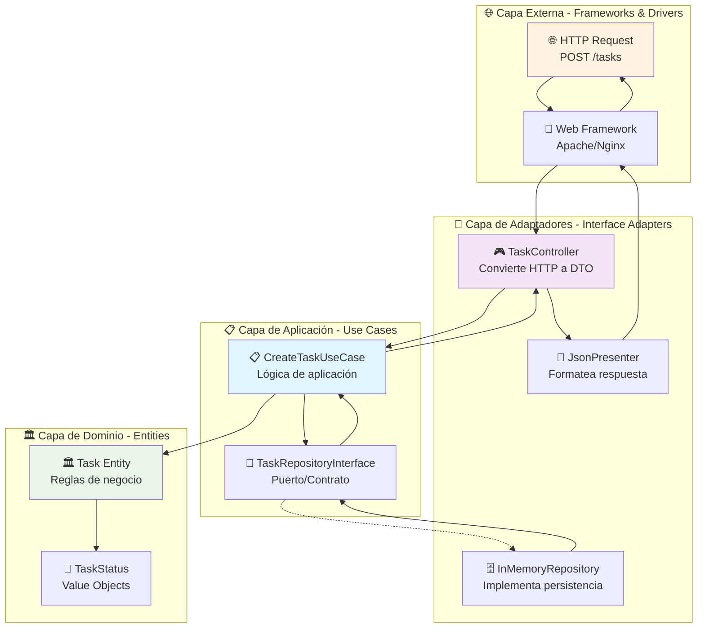

# 🏛️ Clean Architecture - Gestión de Tareas

Esta es una implementación completa de **Clean Architecture** (Arquitectura Limpia) propuesta por Robert C. Martin (Uncle Bob). La aplicación gestiona tareas con operaciones CRUD completas, demostrando los principios fundamentales de esta arquitectura.

## 🎯 ¿Qué es Clean Architecture?

Clean Architecture es un patrón arquitectónico que enfatiza la **separación de responsabilidades** y la **independencia de frameworks, UI, bases de datos y agentes externos**. Su objetivo principal es crear sistemas que sean:

- **Independientes de Frameworks**: No depende de librerías externas
- **Testeable**: Fácil de probar sin UI, base de datos o servicios externos
- **Independiente de UI**: La UI puede cambiar sin afectar el resto del sistema
- **Independiente de Base de Datos**: Puedes cambiar de Oracle a SQL Server sin problemas
- **Independiente de Agentes Externos**: Las reglas de negocio no saben nada del mundo exterior

## 🏗️ Estructura del Proyecto

```
clean-architecture/
├── 📂 src/
│   ├── 🏛️ Entities/                    # Capa 1: Entidades (Núcleo)
│   │   ├── Task.php                   # Entidad principal
│   │   ├── TaskStatus.php             # Value Object - Estado
│   │   └── TaskPriority.php           # Value Object - Prioridad
│   ├── 📋 UseCases/                   # Capa 2: Casos de Uso
│   │   ├── TaskRepositoryInterface.php # Contrato del repositorio
│   │   ├── CreateTask/                # Crear tarea
│   │   ├── GetTask/                   # Obtener tarea
│   │   ├── ListTasks/                 # Listar tareas
│   │   ├── UpdateTask/                # Actualizar tarea
│   │   └── DeleteTask/                # Eliminar tarea
│   ├── 🔌 InterfaceAdapters/          # Capa 3: Adaptadores de Interfaz
│   │   ├── Controllers/               # Controladores web
│   │   ├── Presenters/                # Formateadores de respuesta
│   │   └── Gateways/                  # Implementaciones de repositorios
│   └── 🔧 FrameworksAndDrivers/       # Capa 4: Frameworks y Drivers
│       ├── Config/                    # Configuración y DI
│       └── Web/                       # Manejo HTTP y CORS
├── 📂 public/                         # Punto de entrada web
│   ├── index.php                      # Bootstrap de la aplicación
│   └── .htaccess                      # Configuración Apache
├── 📂 tests/                          # Tests unitarios
└── 📄 README.md                       # Esta documentación
```

## 🔄 Las 4 Capas de Clean Architecture

### 1️⃣ **Entities (Entidades)** - El Núcleo del Negocio

```php
// Ejemplo: Task.php
class Task {
    private int $id;
    private string $title;
    private TaskStatus $status;
    
    public function markAsCompleted(): void {
        if ($this->status === TaskStatus::COMPLETED) {
            throw new DomainException("La tarea ya está completada");
        }
        $this->status = TaskStatus::COMPLETED;
    }
}
```

**Características:**
- ✅ Contienen las reglas de negocio más generales
- ✅ No dependen de nada externo
- ✅ Son los objetos menos propensos a cambiar
- ✅ Encapsulan la lógica de dominio crítica

### 2️⃣ **Use Cases (Casos de Uso)** - Lógica de Aplicación

```php
// Ejemplo: CreateTaskUseCase.php
class CreateTaskUseCase {
    public function execute(CreateTaskInputData $input): CreateTaskOutputData {
        // 1. Validar datos de entrada
        $this->validateInput($input);
        
        // 2. Crear entidad (aplicar reglas de negocio)
        $task = new Task($input->title, $input->description);
        
        // 3. Persistir usando puerto
        return $this->repository->save($task);
    }
}
```

**Características:**
- ✅ Orquestan el flujo de datos hacia/desde las entidades
- ✅ Contienen reglas de negocio específicas de la aplicación
- ✅ Definen interfaces (puertos) para servicios externos
- ✅ Son independientes de la UI y la base de datos

### 3️⃣ **Interface Adapters (Adaptadores de Interfaz)** - Conversión de Datos

```php
// Ejemplo: TaskController.php
class TaskController {
    public function createTask(): void {
        // 1. Convertir HTTP request a DTO
        $inputData = new CreateTaskInputData($_POST['title'], $_POST['description']);
        
        // 2. Ejecutar caso de uso
        $result = $this->createTaskUseCase->execute($inputData);
        
        // 3. Formatear respuesta
        $this->presenter->presentTask($result);
    }
}
```

**Características:**
- ✅ Convierten datos entre casos de uso y agentes externos
- ✅ Implementan las interfaces definidas por los casos de uso
- ✅ Contienen controladores, presenters y gateways
- ✅ Adaptan formatos de datos (HTTP, JSON, XML, etc.)

### 4️⃣ **Frameworks and Drivers (Frameworks y Drivers)** - Detalles Externos

```php
// Ejemplo: Container.php (Dependency Injection)
class Container {
    public function get(string $className) {
        return match($className) {
            TaskRepositoryInterface::class => new InMemoryTaskRepository(),
            CreateTaskUseCase::class => new CreateTaskUseCase($this->get(TaskRepositoryInterface::class)),
            // ... más configuraciones
        };
    }
}
```

**Características:**
- ✅ Contienen frameworks, drivers, herramientas externas
- ✅ Configuración de dependencias
- ✅ Detalles de infraestructura (web server, base de datos)
- ✅ La capa más externa y volátil

## 🔄 Flujo de Datos en Clean Architecture



## 🚀 API Endpoints Disponibles

### 📋 Gestión de Tareas

| Método | Endpoint | Descripción | Ejemplo |
|--------|----------|-------------|---------|
| `GET` | `/tasks` | Listar todas las tareas | `GET /tasks` |
| `GET` | `/tasks?status=pending` | Filtrar por estado | `GET /tasks?status=completed` |
| `GET` | `/tasks/{id}` | Obtener tarea específica | `GET /tasks/1` |
| `POST` | `/tasks` | Crear nueva tarea | Ver ejemplo abajo |
| `PUT` | `/tasks/{id}` | Actualizar tarea | Ver ejemplo abajo |
| `DELETE` | `/tasks/{id}` | Eliminar tarea | `DELETE /tasks/1` |

### 📊 Endpoints de Estadísticas

| Método | Endpoint | Descripción |
|--------|----------|-------------|
| `GET` | `/tasks/statistics` | Estadísticas generales |
| `GET` | `/tasks/overdue` | Tareas vencidas |

## 🧪 Ejemplos de Uso

### ✅ Crear Nueva Tarea

```bash
curl -X POST http://localhost/LEARN/PATRONES/clean-architecture/public/tasks \
  -H "Content-Type: application/json" \
  -d '{
    "title": "Implementar Clean Architecture",
    "description": "Desarrollar una aplicación completa usando los principios de Clean Architecture",
    "priority": "high",
    "due_date": "2024-12-31 23:59:59"
  }'
```

**Respuesta:**
```json
{
  "success": true,
  "data": {
    "id": 6,
    "title": "Implementar Clean Architecture",
    "description": "Desarrollar una aplicación completa...",
    "status": "pending",
    "priority": "high",
    "created_at": "2024-01-15 10:30:00",
    "due_date": "2024-12-31 23:59:59"
  }
}
```

### 🔄 Actualizar Tarea

```bash
curl -X PUT http://localhost/LEARN/PATRONES/clean-architecture/public/tasks/6 \
  -H "Content-Type: application/json" \
  -d '{
    "status": "in_progress",
    "description": "Desarrollar una aplicación completa usando Clean Architecture. ACTUALIZADO: Ya comenzé con las entidades."
  }'
```

### 📊 Obtener Estadísticas

```bash
curl http://localhost/LEARN/PATRONES/clean-architecture/public/tasks/statistics
```

**Respuesta:**
```json
{
  "success": true,
  "data": {
    "total": 6,
    "pending": 2,
    "in_progress": 2,
    "completed": 1,
    "cancelled": 0,
    "overdue": 1
  }
}
```

## 🎯 Principios SOLID Aplicados

### 🔹 **S - Single Responsibility Principle**
Cada clase tiene una única responsabilidad:
- `Task`: Solo maneja la lógica de una tarea
- `CreateTaskUseCase`: Solo se encarga de crear tareas
- `JsonPresenter`: Solo formatea respuestas JSON

### 🔹 **O - Open/Closed Principle**
Abierto para extensión, cerrado para modificación:
- Nuevos casos de uso sin modificar existentes
- Nuevos adaptadores sin cambiar interfaces

### 🔹 **L - Liskov Substitution Principle**
Las implementaciones son intercambiables:
- `InMemoryTaskRepository` puede ser reemplazado por `MySQLTaskRepository`

### 🔹 **I - Interface Segregation Principle**
Interfaces específicas y cohesivas:
- `TaskRepositoryInterface` solo define operaciones de persistencia

### 🔹 **D - Dependency Inversion Principle**
Depender de abstracciones, no de concreciones:
- Los casos de uso dependen de `TaskRepositoryInterface`, no de implementaciones específicas

## 🧪 Testing y Calidad

### Ventajas para Testing

```php
// Ejemplo de test unitario
class CreateTaskUseCaseTest extends PHPUnit\Framework\TestCase {
    public function testCreateTaskSuccessfully() {
        // Arrange
        $mockRepository = $this->createMock(TaskRepositoryInterface::class);
        $useCase = new CreateTaskUseCase($mockRepository);
        $inputData = new CreateTaskInputData('Test Task', 'Description');
        
        // Act
        $result = $useCase->execute($inputData);
        
        // Assert
        $this->assertEquals('Test Task', $result->title);
    }
}
```

**Beneficios:**
- ✅ **Mocking fácil**: Interfaces permiten crear mocks simples
- ✅ **Tests rápidos**: No necesita base de datos real
- ✅ **Aislamiento**: Cada capa se puede testear independientemente
- ✅ **Cobertura alta**: Lógica de negocio completamente testeable

## 🔧 Configuración e Instalación

### Requisitos
- **PHP 8.1+** (para enums y readonly properties)
- **Servidor web** con mod_rewrite
- **cURL** para testing (opcional)

### Instalación

1. **Clonar/Descargar** el proyecto
2. **Configurar servidor** para servir desde `public/`
3. **Habilitar mod_rewrite** en Apache
4. **Probar la API**:

```bash
# Probar que funciona
curl http://localhost/LEARN/PATRONES/clean-architecture/public/tasks

# Ejecutar script de pruebas
php test_api.php
```

## 🎓 Conceptos Avanzados Demostrados

### 🔸 **Value Objects**
```php
enum TaskStatus: string {
    case PENDING = 'pending';
    case IN_PROGRESS = 'in_progress';
    case COMPLETED = 'completed';
    
    public function canTransitionTo(TaskStatus $newStatus): bool {
        // Lógica de transiciones válidas
    }
}
```

### 🔸 **Domain Events** (Preparado para extensión)
```php
// Futuro: Eventos de dominio
class TaskCompleted {
    public function __construct(public readonly Task $task) {}
}
```

### 🔸 **Dependency Injection Container**
```php
class Container {
    // Configuración automática de dependencias
    // Soporte para singletons
    // Resolución automática por reflexión
}
```

## ⚖️ Comparación con Otros Patrones

| Aspecto | Clean Architecture | MVC | Hexagonal |
|---------|-------------------|-----|-----------|
| **Complejidad** | ⭐⭐⭐⭐⭐ Alta | ⭐⭐ Baja | ⭐⭐⭐⭐ Media-Alta |
| **Testabilidad** | ⭐⭐⭐⭐⭐ Excelente | ⭐⭐⭐ Buena | ⭐⭐⭐⭐⭐ Excelente |
| **Mantenibilidad** | ⭐⭐⭐⭐⭐ Excelente | ⭐⭐⭐ Buena | ⭐⭐⭐⭐ Muy Buena |
| **Curva de Aprendizaje** | ⭐⭐⭐⭐⭐ Muy Alta | ⭐⭐ Baja | ⭐⭐⭐⭐ Alta |
| **Independencia** | ⭐⭐⭐⭐⭐ Total | ⭐⭐ Parcial | ⭐⭐⭐⭐ Muy Alta |

## 🎯 Cuándo Usar Clean Architecture

### ✅ **Ideal Para:**
- 🏢 **Aplicaciones empresariales** complejas
- 🔄 **Sistemas con lógica de negocio** crítica
- 🧪 **Proyectos que requieren** alta cobertura de tests
- 👥 **Equipos grandes** con diferentes especialidades
- 🔧 **Sistemas que cambiarán** de tecnología frecuentemente
- 📈 **Aplicaciones de larga duración** (5+ años)

### ❌ **No Recomendado Para:**
- 🚀 **Prototipos rápidos** o MVPs
- 📱 **Aplicaciones simples** tipo CRUD
- 👤 **Proyectos de una sola persona** pequeños
- ⏰ **Deadlines muy ajustados**
- 🎓 **Equipos sin experiencia** en arquitectura

## 📚 Recursos Adicionales

### 📖 **Libros Recomendados**
- [Clean Architecture - Robert C. Martin](https://www.amazon.com/Clean-Architecture-Craftsmans-Software-Structure/dp/0134494164)
- [Clean Code - Robert C. Martin](https://www.amazon.com/Clean-Code-Handbook-Software-Craftsmanship/dp/0132350882)
- [Domain-Driven Design - Eric Evans](https://www.amazon.com/Domain-Driven-Design-Tackling-Complexity-Software/dp/0321125215)

### 🎥 **Videos y Conferencias**
- [Clean Architecture and Design - Uncle Bob](https://www.youtube.com/watch?v=o_TH-Y78tt4)
- [The Principles of Clean Architecture - Uncle Bob](https://www.youtube.com/watch?v=o_TH-Y78tt4)

### 🔗 **Enlaces Útiles**
- [Clean Architecture Blog - Uncle Bob](https://blog.cleancoder.com/uncle-bob/2012/08/13/the-clean-architecture.html)
- [Hexagonal Architecture - Alistair Cockburn](https://alistair.cockburn.us/hexagonal-architecture/)

---

## 🎉 Conclusión

Esta implementación de Clean Architecture demuestra cómo crear aplicaciones **mantenibles, testeable y flexibles**. Aunque requiere más esfuerzo inicial, los beneficios a largo plazo son significativos:

- 🧪 **Testing exhaustivo** sin dependencias externas
- 🔄 **Cambios de tecnología** sin afectar la lógica de negocio
- 👥 **Colaboración en equipo** con responsabilidades claras
- 📈 **Escalabilidad** y mantenimiento a largo plazo

**¡Explora, experimenta y construye software de calidad! 🚀**

